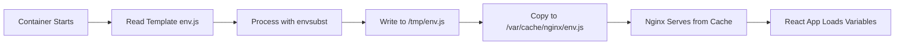

# Read-Only Filesystem Fix for Runtime Environment Injection

## Issue Identified

When deploying OpenPrime with Helm/Helmfile, the application was crashing with:

```
🔧 Injecting runtime environment variables...
mv: can't remove '/usr/share/nginx/html/env.js': Read-only file system
```

**Root Cause**: The Helm chart uses `readOnlyRootFilesystem: true` for security hardening, but our environment injection script was trying to overwrite files in the read-only filesystem.

## Solution Implemented

### 1. Updated Container Startup Script

**Before (failing):**
```bash
envsubst < /usr/share/nginx/html/env.js > /tmp/env.js
mv /tmp/env.js /usr/share/nginx/html/env.js  # ← FAILS: read-only filesystem
```

**After (working):**
```bash
envsubst < /usr/share/nginx/html/env.js > /tmp/env.js
cp /tmp/env.js /var/cache/nginx/env.js  # ← SUCCESS: writable volume
```

### 2. Updated Nginx Configuration

Added special routing for `/env.js` to serve from writable cache directory:

```nginx
# Serve processed env.js from writable cache directory
location = /env.js {
    alias /var/cache/nginx/env.js;
    add_header Cache-Control 'no-cache, no-store, must-revalidate';
    add_header Pragma 'no-cache';
    add_header Expires '0';
}
```

### 3. Leverage Existing Volume Mounts

The Helm chart already provides writable volumes:
- `/tmp` - emptyDir volume
- `/var/cache/nginx` - emptyDir volume
- `/var/run` - emptyDir volume

We use `/var/cache/nginx` since it's semantically appropriate for serving cached/processed content.

## How It Works Now

### Container Startup Flow:


### File Locations:
1. **Template**: `/usr/share/nginx/html/env.js` (read-only, with `$REACT_APP_*` variables)
2. **Processing**: `/tmp/env.js` (temporary, processed content)
3. **Serving**: `/var/cache/nginx/env.js` (writable, final processed file)

### HTTP Request Flow:
```
Browser Request: GET /env.js
↓
Nginx: location = /env.js
↓
Serve: /var/cache/nginx/env.js (processed runtime variables)
↓
JavaScript: window._env_ = {API_URL: "http://api.prod.com/api", ...}
```

## Security Benefits Maintained

✅ **Read-only root filesystem**: Prevents modification of application code
✅ **Non-root user**: Runs as nginx user (UID 101)
✅ **Dropped capabilities**: No privileged operations allowed
✅ **No privilege escalation**: Container security hardening maintained

## Testing the Fix

### 1. Check Container Logs
```bash
kubectl logs -n openprime deployment/openprime-app
# Should show: 🔧 Injecting runtime environment variables...
#              ✅ Environment variables injected successfully
```

### 2. Verify File Processing
```bash
kubectl exec -n openprime deployment/openprime-app -- cat /var/cache/nginx/env.js
# Should show actual values, not template variables like $REACT_APP_API_URL
```

### 3. Test HTTP Endpoint
```bash
kubectl exec -n openprime deployment/openprime-app -- wget -qO- http://localhost:8080/env.js
# Should return processed JavaScript with actual environment values
```

### 4. Browser Console Verification
```javascript
// Access the app and check browser console
console.log(window._env_);
// Should show: {API_URL: "http://api.openprime.local/api", ...}
// Should NOT show: {API_URL: "$REACT_APP_API_URL", ...}
```

## Deployment Compatibility

### ✅ **Works With:**
- Helm charts with `readOnlyRootFilesystem: true`
- Kubernetes security policies
- Container security scanning
- Multi-environment deployments

### ✅ **Maintains:**
- Runtime environment injection functionality
- Container security hardening
- Performance (nginx serves from memory-backed emptyDir)
- Cache headers prevent browser caching of environment config

## Alternative Approaches Considered

### ❌ **Disable Read-Only Filesystem**
- Reduces security posture
- Goes against best practices
- Not acceptable for production

### ❌ **Init Container Approach**
- More complex deployment
- Requires shared volumes between containers
- Unnecessary complexity for this use case

### ✅ **Writable Volume + Nginx Alias (Chosen)**
- Maintains security hardening
- Uses existing volume mounts
- Simple and reliable
- No additional Kubernetes resources needed

## Future Considerations

- Consider using a ConfigMap for environment variables if runtime injection becomes unnecessary
- Monitor `/var/cache/nginx` volume usage (though env.js is tiny ~1KB)
- Could extend this pattern for other runtime-configurable assets

This fix ensures OpenPrime works correctly with security-hardened Kubernetes deployments while maintaining the flexibility of runtime environment injection.
